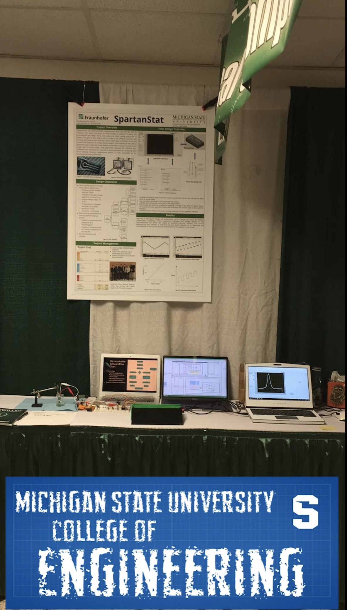

# ECE480
SpartanStat

Potentiostats are electrochemical measurement tools that can be used to measure and detect the levels of heavy metals in solutions. Present day potentiostats are large, heavy, and expensive, often costing thousands of dollars. The goal of this project was to create a cheap, portable, and accurate potentiostat that could be used to collect data in the field, or be used as part of a larger unit to analyze blood samples. The potentiostat was able to generate square wave and linear sweep voltammetry, measure currents in the single digit microamp range, and graphically represent the collected data. Validation and performance evaluations were conducted by comparing data from industry standard potentiostat devices   to   data   generated   by   the   developed   portable   potentiostat.

This work would not have been possible without the support of the Michigan State University College of Electrical and Computer Engineering, and Fraunhofer USA. The design team would like to express their gratitude to our sponsor, Dr. Rusinek, and our facilitator, Dr. Fan, for their patience, guidance, and valuable and constructive critiques of this project. The design team would also like to thank Dr. Albrecht and Dr. Udpa for their professional advice   and   for   keeping   our   progress   on   schedule.

Awards: http://designday.msu.edu/fall2017/electrical-engineering/spring-2017-awards/

##### Design Day Setup 
 

###### Poster
 

